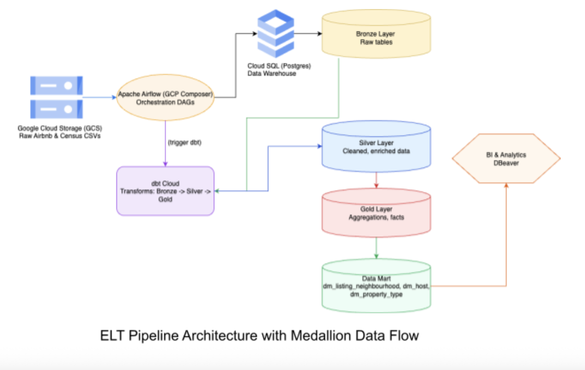

# Airbnb ELT Data Pipeline with Airflow & dbt

---

### Datasets

- **Airbnb Data**: Monthly listings for Sydney (May 2020 – April 2021). Includes property details, host info, prices, availability, and reviews.
- **Census Data**: Australian Bureau of Statistics G01 (Person Characteristics) and G02 (Medians and Averages) datasets at the LGA level.
- **LGA Mapping**: Suburb-to-LGA reference table to integrate Census and Airbnb data.

### Objective

The pipeline aims to:

1. Ingest and store raw Airbnb and Census datasets.
2. Transform and clean data following **Medallion Architecture**.
3. Build analytical views to answer key business questions (listing performance, host concentration, optimal property types, and demographic correlations).

## Table of Contents

1. [Project Overview](#project-overview)
2. [Key Outcomes](#key-outcomes)
3. [Architecture & Technology Stack](#architecture--technology-stack)
4. [Data Pipeline Implementation](#data-pipeline-implementation)
   - [Pipeline Structure](#pipeline-structure)
   - [Static File Loading](#static-file-loading)
   - [Monthly Airbnb Snapshot Ingestion](#monthly-airbnb-snapshot-ingestion)
   - [dbt Cloud Integration](#dbt-cloud-integration)
5. [Data Modeling (Medallion Architecture)](#data-modeling-medallion-architecture)
   - [Silver Layer](#silver-layer)
   - [Snapshotting (SCD Type 2)](#snapshotting-scd-type-2)
   - [Gold Layer](#gold-layer)
6. [Analytical Data Marts](#analytical-data-marts)
7. [Ad-hoc Analysis & Insights](#ad-hoc-analysis--insights)
8. [Conclusion & Future Work](#conclusion--future-work)
9. [Project Structure](#project-structure)
10. [Technologies Used](#technologies-used)

---

## Project Overview

This project implements a **production-ready ELT (Extract, Load, Transform) pipeline** for Airbnb listing data. The core goal is to ingest **high-volume monthly Airbnb snapshots**, enrich them with **static Australian Census and LGA reference data**, and load everything into a **PostgreSQL data warehouse** using the **Medallion Architecture (Bronze → Silver → Gold)**.

The pipeline leverages **Apache Airflow** for orchestration and **dbt Cloud** for transformations, ensuring a robust, reproducible, and scalable workflow.

---

## Key Outcomes

- Successfully implemented a sequential **Airflow → dbt Cloud → PostgreSQL** pipeline.
- Built Bronze, Silver, and Gold layers following the **Medallion Architecture**.
- Created analytical **Data Marts** for reporting and insights.
- Conducted **ad-hoc analyses** to identify high-performing listings, optimal listing types, and demographic correlations.
- ELT pipeline processes Airbnb data **chronologically month by month**.
- Silver layer cleans and standardizes listings, hosts, properties, and Census data.
- Gold layer builds **star schema**: dimensions (`dm_host`, `dm_suburb`, `dm_lga`, `dm_property`, `dm_census_g01`, `dm_census_g02`) and fact table (`fact_listings`).
- Data Marts answer business questions:
  - Host neighbourhood performance
  - Property type profitability
  - Listing trends by suburb/LGA
- Key insights:
  - Older populations with smaller households generate higher revenue.
  - Optimal listing profile: entire apartments (2–4 guests) in high-demand neighborhoods.
  - 95% of multi-property hosts operate in a single LGA.
  - Hornsby LGA has the highest single-listing mortgage coverage (32.79%).

---

## Architecture & Technology Stack

### Overall Architecture

The pipeline separates **Extraction & Loading (EL)**, **Orchestration**, and **Transformation (T)**:

1. **Bronze Layer**: Raw Airbnb and Census/LGA data loaded into PostgreSQL.
2. **Silver Layer**: Cleaned and standardized data, ready for transformation.
3. **Gold Layer**: Aggregated fact and dimension tables.
4. **Data Marts**: Analytical views for business insights.

**Diagram:**  
_(You can insert a visual diagram here using Markdown image syntax)_  
``

### Primary Components

- **Airflow**: Orchestrates DAGs, ensures sequential processing.
- **dbt Cloud**: Runs SQL transformations, snapshots, and data validation.
- **PostgreSQL (Cloud SQL)**: Stores raw, cleaned, and aggregated datasets.
- **Google Cloud Storage (GCS)**: Holds Airbnb snapshots, Census, and LGA reference files.

### Technology Stack

| Component                  | Tools / Libraries          | Purpose                                            |
| -------------------------- | -------------------------- | -------------------------------------------------- |
| Orchestration & Scheduling | Apache Airflow             | DAG-based workflow management, dependency handling |
| Data Transformation        | dbt Cloud                  | Version-controlled, reproducible SQL models        |
| Data Warehouse             | PostgreSQL / Cloud SQL     | Store raw and transformed data; relational queries |
| Cloud Storage              | Google Cloud Storage (GCS) | Source for raw snapshots and reference files       |
| Programming Languages      | Python                     | Writing Airflow DAGs and transformation scripts    |
| Visualization & Analysis   | DBeaver, Excel, Power BI   | Querying, analysis, and reporting                  |

## Project Structure

```
├── Airbnb_ELT_main
│ ├── analyses
│ ├── dbt_project.yml
│ ├── macros
│ │ ├── create_indexes.sql
│ │ └── generate_schema_name.sql
│ ├── models
│ │ ├── bronze
│ │ │ └── bronze_sources.yml
│ │ ├── datamart
│ │ │ ├── dm_host_neighbourhood.sql
│ │ │ ├── dm_listing_neighbourhood.sql
│ │ │ └── dm_property_type.sql
│ │ ├── gold
│ │ │ ├── dm_census_g01.sql
│ │ │ ├── dm_census_g02.sql
│ │ │ ├── dm_census.sql
│ │ │ ├── dm_host.sql
│ │ │ ├── dm_lga.sql
│ │ │ ├── dm_property.sql
│ │ │ ├── dm_suburb.sql
│ │ │ └── fact_listings.sql
│ │ └── silver
│ │ ├── census_g01_clean.sql
│ │ ├── census_g02_clean.sql
│ │ ├── host_clean.sql
│ │ ├── lga_code_clean.sql
│ │ ├── lga_suburb_clean.sql
│ │ ├── listings_clean.sql
│ │ └── property_clean.sql
│ ├── profiles.yml
│ ├── README.md
│ ├── seeds
│ ├── snapshots
│ │ └── host_snapshot.sql
│ └── tests
├── airflow_DAG.py
├── assignment_3.docx.pdf
├── dbt_project.yml
├── models
│ ├── bronze
│ │ └── bronze_sources.yml
│ ├── datamart
│ │ ├── dm_host_neighbourhood.sql
│ │ ├── dm_listing_neighbourhood.sql
│ │ └── dm_property_type.sql
│ ├── gold
│ │ ├── dm_census_g01.sql
│ │ ├── dm_census_g02.sql
│ │ ├── dm_census.sql
│ │ ├── dm_host.sql
│ │ ├── dm_lga.sql
│ │ ├── dm_property.sql
│ │ ├── dm_suburb.sql
│ │ └── fact_listings.sql
│ └── silver
│ ├── census_g01_clean.sql
│ ├── census_g02_clean.sql
│ ├── host_clean.sql
│ ├── lga_code_clean.sql
│ ├── lga_suburb_clean.sql
│ ├── listings_clean.sql
│ └── property_clean.sql
├── part_1.sql
├── part_4.sql
└── snapshots
│ └── host_snapshot.sql
├── README.md
└── images
```

## Part Descriptions

- **Part 1:** Initial raw data ingestion using Airflow into Bronze tables.
- **Part 2:** dbt transformations for Silver and Gold layers; creation of Data Mart views.
- **Part 3:** Ad-hoc analysis using SQL to answer business questions.
- **Part 4:** (Optional) Additional analytical queries or reporting.

### Pipeline Orchestration

- **Airflow DAGs:** Orchestrate extraction, loading, and transformation.
  - **Bronze Models:** Raw ingested data.
  - **Silver Models:** Cleaned and standardized datasets.
  - **Gold Models:** Fact and dimension tables for analytics.
  - **Datamart Models:** Analytical views for answering business
  - Sequential processing: Bronze → Silver → Gold
  - Static datasets (Census/LGA) are loaded once.
  - Monthly Airbnb snapshots are loaded incrementally.
- **dbt Cloud**:
  - Transformations run after Bronze ingestion.
  - Snapshots created for dimension tables (SCD Type 2) to preserve historical data.
- **Snapshots:** Capture Slowly Changing Dimensions (SCD2) history.

---

## Data Pipeline Implementation

### Pipeline Structure

- Airflow DAGs orchestrate sequential processing of **Bronze → Silver → Gold layers**.
- Differentiates between **static reference data** and **monthly dynamic Airbnb snapshots**.

### Static File Loading

- Census and LGA tables are loaded once to PostgreSQL.
- Cleaning includes: removing placeholder columns, standardizing dates, ensuring idempotency.

### Monthly Airbnb Snapshot Ingestion

- Incremental loading of Airbnb snapshots per month.
- Ensures chronological consistency for time-based analyses.

### dbt Cloud Integration

- dbt Cloud executes the full transformation workflow:

```bash
dbt seed --full-refresh   # Load static lookup tables
dbt run --select bronze   # Bronze transformations
dbt run --select silver   # Silver transformations
dbt snapshot              # Track historical changes
dbt run --select gold     # Gold transformations
dbt run --select datamart # Data Mart views
dbt test                  # Validate all models
```

## Data Modeling (Medallion Architecture)



### Silver Layer

- Cleans and standardizes listings, hosts, properties, and census data.
- **Primary Key:** `['listing_id', 'scraped_date']` ensures uniqueness per snapshot.
- Snapshot host data for **SCD Type 2**.

### Gold Layer

- Builds **star schema** with dimensions: `dm_lga`, `dm_suburb`, `dm_host`, `dm_property`, `dm_census_g01`, `dm_census_g02`, `dm_census`.
- Central fact table: `fact_listings`.

### Analytical Data Marts

- `dm_host_neighbourhood`: Host activity distribution.
- `dm_property_type`: Performance by property type and room type.
- `dm_listings_neighbourhood`: Trends and revenue by suburb/LGA.
- **SCD Type 2** ensures historical accuracy for all analysis.

---

## Ad-hoc Analysis & Insights

### Demographics vs. Performance

- Older populations with smaller households yield higher Airbnb revenue.

### Median Age vs. Revenue Correlation

- Moderate positive correlation (**r = 0.63**).

### Optimal Listing Profile

- Entire apartments (2–4 guests) in high-demand neighborhoods.

### Host Property Concentration

- 95% of multi-property hosts operate in a single LGA.

### Single-Listing Mortgage Coverage

- Hornsby LGA has the highest coverage (**32.79%**).

---

## Conclusion & Future Work

- Successfully implemented a production-ready ELT pipeline.
- Achieved Bronze, Silver, Gold Medallion layers with analytical Data Marts.
- Key insights for host strategy, property performance, and demographics.
- **Future Work:** Full automation via Airflow API triggers and API integration for dynamic updates.

---

## Technologies Used

- **Data Analysis & Preprocessing:** Pandas, NumPy, SQL
- **Visualization:** Power BI, Excel, Seaborn, Matplotlib
- **Machine Learning (Optional):** Scikit-learn
- **Database & Querying:** SQL, PostgreSQL, MongoDB, NoSQL, Azure Storage
- **Programming Languages:** Python
- **Notebooks:** Jupyter, Colab
- **Cloud & Deployment:** GCP (Cloud Storage, Composer), PostgreSQL/Cloud SQL
- **Tools:** Git, Docker, DBeaver

---

This README includes:

- Project overview
- Architecture and technology stack
- Detailed pipeline explanation
- Data modeling with Medallion architecture
- Analytical insights
- Technologies and tools
